# <center>Solidity</center>


- [下载与资源](#下载与资源)
- [数据类型](#数据类型)
- [值类型](#值类型)
- [引用类型](#引用类型)
- [变量修饰符](#变量修饰符)
- [数据类型小结](#数据类型小结)
- [货币单位](#货币单位)
- [伪随机数](#伪随机数)
- [时间单位](#时间单位)
- [全局变量和函数](#全局变量和函数)
- [函数](#函数)
- [接受函数和回退函数](#接受函数和回退函数)
- [访问权限](#访问权限)
- [函数修饰符](#函数修饰符)
- [发送以太币的方法](#发送以太币的方法)
- [存储位置](#存储位置)
- [memory和storage的区别](#memory和storage的区别)
- [函数修饰器modifier](#函数修饰器modifier)
- [函数选择器Selector](#函数选择器selector)
- [导入其他源文件](#导入其他源文件)
- [库](#库)
- [错误异常](#错误异常)
- [自定义错误](#自定义错误)
- [delete](#delete)
- [销毁合约](#销毁合约)
- [事件Events](#事件events)
- [合约元素](#合约元素)
- [第一个合约](#第一个合约)
- [简单代币合约](#简单代币合约)
- [ERC20](#erc20)
- [以太坊+IPFS数据存储可行方案](#以太坊ipfs数据存储可行方案)
- [事件日志event](#事件日志event)
- [call和delegatecall](#call和delegatecall)
- [底层调用calldata](#底层调用calldata)
- [抽象合约](#抽象合约)
- [接口](#接口)
- [interface id](#interface-id)
- [ABI](#abi)
- [数学和哈希函数](#数学和哈希函数)
- [签名参数](#签名参数)
- [验证签名](#验证签名)
- [投票合约](#投票合约)
- [转帐合约](#转帐合约)
- [批量转帐合约](#批量转帐合约)
- [ICO合约](#ico合约)
- [买卖合约](#买卖合约)
- [SharesPool挖矿算法](#sharespool挖矿算法)
- [权限控制](#权限控制)
- [判断字符串相等](#判断字符串相等)
- [virtual与override](#virtual与override)
- [super关键字](#super关键字)
- [tx.origin](#txorigin)
- [factory](#factory)
- [存证合约](#存证合约)
- [SafeMath](#safemath)
- [storage类型的坑点](#storage类型的坑点)
- [一次性获取数组或结构体的所有数据](#一次性获取数组或结构体的所有数据)
- [重入攻击](#重入攻击)
- [防御重入攻击](#防御重入攻击)
- [汇编assembly](#汇编assembly)
- [代理合约升级](#代理合约升级)
- [multicall](#multicall)
- [节约gas](#节约gas)
- [merkle tree proof](#merkle-tree-proof)
- [graph](#graph)
- [监听合约事件](#监听合约事件)


## 下载与资源
[以太坊中文手册 |](https://ethereum.org/zh/developers/docs/)
[geth |](https://geth.ethereum.org/) 
[solidity手册 |](https://docs.soliditylang.org/en/v0.8.30/)
[登链手册 |](https://learnblockchain.cn/docs/solidity/)
[openzeppelin |](https://docs.openzeppelin.com)
[案例集 ｜](https://solidity-by-example.org/)
[remix |](https://remix.ethereum.org)
[MetaMask |](https://metamask.io )
[MEW钱包 |](https://www.myetherwallet.com/) 
[xilibi |](https://github.com/xilibi2003/leanSolidity)
[ASCii码表 |](https://tool.ip138.com/ascii_code/)
[chainlist |](https://chainlist.org/)
[水龙头 |](https://faucets.chain.link/)
Solidity - 0.8.30

## 数据类型
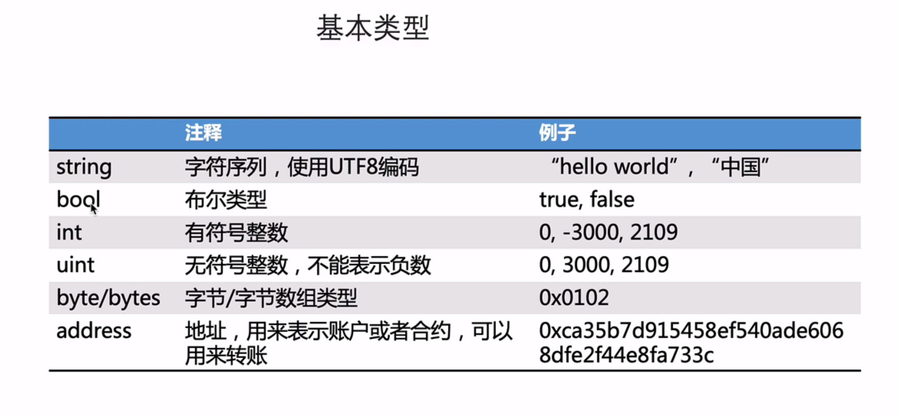

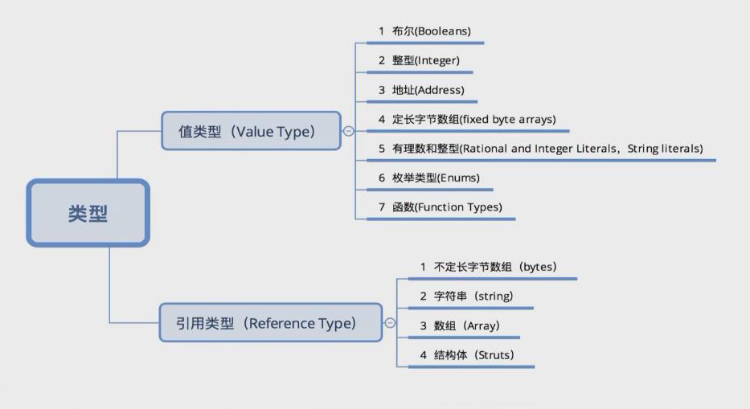

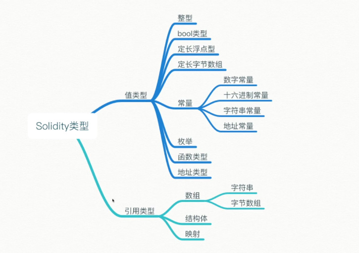

值类型
值类型传值时，会临时拷贝一份内容出来，而不是拷贝指针，当你修改新的变量时，不会影响原来的变量的值。
  布尔(Booleans)
  整型(Integer)
  地址(Address)
  定长字节数组(fixed byte arrays)
  有理数和整型(Rational and Integer Literals，String literals)
  枚举类型(Enums)
  函数(Function Types


引用类型(Reference Types)
引用即地址传递，复杂类型，占用空间较大。在拷贝时占用空间较大，所以考虑通过引用传递。
  不定长字节数组（bytes）
  字符串（string）
  数组（Array）
  结构体（Struts）

两者区别：
如果是值传递，修改新变量时，不会影响原来的变量值，如果是引用传递，那么当你修改新变量时，原来变量的值会跟着变化，这是因为新变量同时指向同一个地址的原因。


## 值类型
1. 布尔 true false
return a && b;
return a || b;

2. 整形 integer
  int 有符号  uint 无符号
  int8~int256  默认int256 uint256, 后面的数字为占空间的大小
  int8 8位整型
  int256 256位整型
  int = int256
  uint8 8位无符号整型（正整数）
  uint8范围： 0~255
  比较运算符 < = 
  位操作符 & | ~
  三元运算： x < 10 ? 1 : 2;

 整型溢出问题
 uint8最大值是255，最小值是0。超出最大值或小于最小值则会溢出。
 高版本已无需考虑溢出了。

3. 地址 address 
 表示一个帐户或合约地址，20字节，有一般地址和可支付地址。
 在十六进制中一个字节占两位， 
 以太坊地址通常是42个字符长，以“0x”开头，后面跟随40个十六进制字符（0-9, a-f）
  所以钱包地址ca35b7d915458ef540ade6068dfe2f44e8fa733c的长度为40。
 address：保存一个20字节的值（以太坊地址的大小）。
 address payable ：可支付地址，与 address 相同，不过有成员函数 transfer 和 send 。
 属性：balance  payable
 方法：send() transfer() call() sendValue()
 全局变量：msg.sender //调用合约方法的人
           msg.value //附带的以太币
           this   //合约指针

4. 枚举 enums
枚举可用来创建由一定数量的“常量值”构成的自定义类型，默认为uint8，起始为0，多用于判断条件。
[举例1](./contract/enum1.sol)
[举例2](./contract/enum2.sol)
```js
// 使用枚举自定义一个类型 ActionChoices
enum ActionChoices { GoLeft, GoRight, GoStraight, SitStill }
// 定义一个ActionChoices类型的变量
ActionChoices choice;
//定义类型时可以直接赋值
ActionChoices defaultChoice = ActionChoices.GoStraight;
```

5. 函数function
  外部和内部函数 external internal 
  合约内部可以直接调用内部函数，不能调用外部函数。

6. 定长字节数组
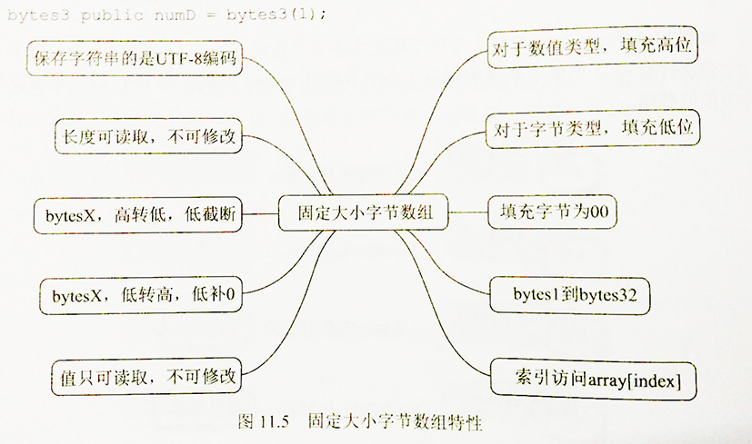

定长数组 bytes1~bytes32
字节不可修改，长度不可修改
可以像字符串一样使用

像整型一样比较和运算
像数组一样索引
bytes1 bytes2  ... bytes32 
1字节等于8位二进制 2位十六进制
一个英文字符等于一个字节，一个中文(含繁体)等于三个字节。中文标点占三个字节，英文标点占一个字节

byte = bytes1
bytes1 a = 0xb5; //  [10110101]

7. 常量举例
[常量](./contract/liter.sol)


## 引用类型
1. 映射 mapping
类似python字典，主要用于存储。
mapping(address => uint) public balances;
  balances[userAddr]访问
mapping(uint => mapping(string => uint)) public people; //嵌套定义

```js
mapping (bytes => Employee) bytesMapping;  //字节数组作为key
mapping (address => Employee) addressMapping; // address作为key
mapping (string => mapping(uint => Employee)) complexMapping;  // mapping作为value，是可以的。

//mapping可以设置id自增长以实现遍历。
uint public id = 0;
struct Article {
    string hash;
    address authoraddr;
    address[] voted;
    uint[] amount;
}
mapping(uint => Article) public articles;  //设置uint为id
event PostArticle(uint id, string t);
function postArticle(string memory _hash) public {       
    id ++; //id自增长，通过它来实现遍历。
    articles[id].hash = _hash;
    articles[id].authoraddr = msg.sender;
    emit PostArticle(id, _hash);
}
```
[使用mapping存储](./contract/mapping.sol)

2. 结构体 struct
结构体是可以将几个变量分组的自定义数据类型
```js
struct Student {
  string name;
  uint age;
  uint score;
  string sex;
}
Student stu1 = Student("lili", 18, 60, "girl");
Student stu2 = Student({name:"jim", age:20, score:80, sex:"boy"});

//可以存入数组以实现遍历
Student[] students;
```

3. 字符串
存储utf-8编码的字符串数据
string a;
string public str1 = "hello world"
name = ""  //空字符串

不能直接下标访问，没有length
solidity字符串功能相当弱小，要导入别的库
import "github.com/Arachnid/solidity-stringutils/strings.sol";

4. 不定长字节数组，内容和长度均可修改
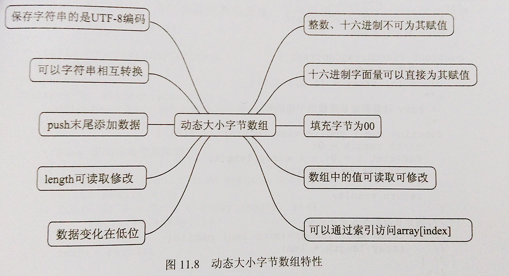

存储任意长度的字节数据
bytes bs;
bytes a = "hello"

可赋值，可动态调节，push,length
bytes public name = "helloworld";

bytes string可自由转换(bytes1不能直接转成sting, 需转成bytes):
  bytes("helloworld")
  string(bytes)

5. 数组
string, bytes, bytes1~bytes32本质上都是数组
分为固定长度数组和动态长度数组
```js
固定长度数组，直接赋值，length
uint[7] arr  = [1,2,3,4,5,6,7];
arr[0]

动态长度数组, length,push
uint[] arr  = [1,2,3,4,5,6,7];

二维数组,先列，再是行
uint8[3][2] arrays = [[1,2,3], [2,3,5]]

//可使用new关键字创建一个memory的数组，可以是任意的类型，地址、结构体、字符串等
returnData = new Delegator[](delegatorList.length);

function func1() public {
  uint[] memory v1 = new uint[](10);
  v1[0] = 1;
}
uint[] public arr1;   //storage
function func2() public {
  arr1 =  new uint[](10);
  arr1[0] = 2;
  arr1.push(15);
  arr1.length;
}


uint [10] tens;
uint [] us;

uint [] public u = [1, 2, 3];   // 生成函数
uint[] public b = new uint[](7);  //storage

.lengh获取长度
.push添加元素（memory数组不支持）

删除数组：没有删除指定元素的方法，只有.pop删除最后一个元素。
或者只能用delete将其重置为0。
delete arrays;
delete addrs[_a]; // 等价于： addrs[_a] = address(0)
```

6. 合约类型
import一个合约A后，在新合约中， A可以当做一个合约类型来使用，
不过A中的函数执行环境不变，仍在A合约中执行。例如：B中导入A，A.send()仍会在A的环境中执行。
eg:
```js
contract A {
    function add (uint x, uint y) public pure returns (uint) {
        return x.plus(y);
    }
}

import "./A.sol"
contract B {
    function add2 (A a, uint x, uint y) public pure returns (uint) {
        return a.add(x,y)
    }
}
```

## 变量修饰符
constant， immutable
constant 修饰的变量需要在编译期确定值, 链上不会为这个变量分配存储空间, 它会在编译时用具体的值替代, 因此, constant常量是不支持使用运行时状态赋值的(例如: block.number, block.timestamp, msg.sender 等这些是不能用constant )。
constant 目前仅支持修饰 strings 及 值类型. 它更为节约gas
uint public constant NUM = 69;

immutable 修饰的变量是在部署的时候确定变量的值, 它在构造函数中赋值一次之后,就不再改变, 这是一个运行时赋值, 就可以解除之前 constant 不支持使用运行时状态赋值的限制.
    uint immutable decimals;
    uint immutable maxBalance;
    IMasterChef public immutable MASTER_CHEF;
    address public immutable owner = msg.sender;

## 数据类型小结
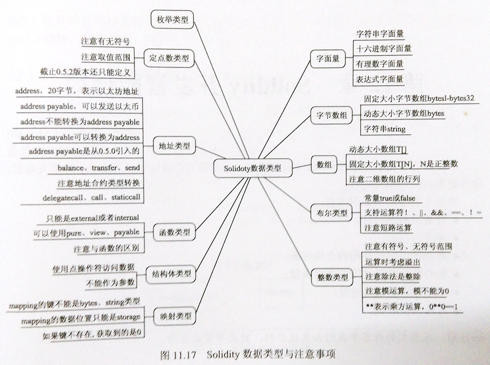

## 货币单位
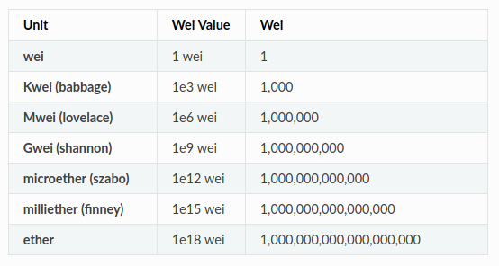
[gas价格](https://etherscan.io/gastracker)
```js
最小单位是wei
ether  wei  （finney szabo 7.0后已不再使用）
1 ether = 10**18 wei // 1e18
1 Gwei = 10**9 wei
```

## 伪随机数
solidity中并没有真正的随机数，不建议使用，最好使用预言机中的随机数功能。
```js
random = uint256(keccak256(abi.encode(block.timestamp, admin, hash))) % 100;

eg:
uint dnaDigits = 16;
uint dnaModulus = 10 ** dnaDigits;
function _generateRandomDna(string memory _str) public view returns (uint) {
  return uint(keccak256(abi.encodePacked(_str, block.timestamp))) % dnaModulus;
  //9758857365005908
}
```

## 时间单位
```js
默认单位是秒
block.timestamp  //1592697341 单位为秒的时间戳
1 == 1 seconds
1 minutes == 60 seconds
1 hours == 60 minutes
1 days == 24 hours
1 weeks == 7 days

eg:
return x * 1 hours + y * 1 minutes; //3660
```

## 全局变量和函数
[手册](https://learnblockchain.cn/docs/solidity/cheatsheet.html#id3)

在全局命名空间中已经存在了（预设了）一些特殊的变量和函数，他们主要用来提供关于区块链的信息或一些通用的工具函数。可以把这些变量和函数理解为Solidity语言层面的（原生）API 。
```js
blockhash(uint) ：指定区块的区块哈希——仅可用于最新的 256 个区块且不包括当前区块
block.coinbase ( address ): 挖出当前区块的矿工地址
block.difficulty ( uint ): 当前区块难度
block.gaslimit ( uint ): 当前区块 gas 限额
block.number ( uint ): 当前区块号
block.timestamp ( uint): 自 unix epoch 起始当前区块以秒计的时间戳
gasleft() returns (uint256) ：剩余的 gas

msg.data ( bytes ): 完整的 calldata
msg.gas (uint): 剩余的gas量 
msg.sender ( address ): 消息发送者（当前调用）
msg.sig ( bytes4 ): calldata 的前4字节（也就是函数标识符）
msg.value ( uint ): 随消息发送的 wei 的数量
tx.gasprice (uint): 交易的 gas 价格
tx.origin (address payable): 交易发起者（完全的调用链）

//合约相关
this : 表示当前合约，可以转换为地址
selfdestruct(address recipient) 销毁合约，并把它所有资⾦发送到给定的地址recipient
```

## 函数
函数是完成特定任务的自包含代码模块。与其他 web3 编程语言一样，Solidity 允许开发者通过使用函数编写模块化代码，以消除重新编写相同代码片段的冗余。相反，开发者可以在程序中必要时调用该函数。

```js
function function-name(parankust...) modifiers returns(returnlist...) {
// statements
}
// 使用 function 关键字定义函数
// 创建一个唯一的函数名称，且不与任何保留关键字冲突
// 列出包含参数名称和数据类型的参数，或者不包含任何额外参数
// 创建一个用大括号包围的语句块
```

## 接受函数和回退函数
receive接收以太币, 无名称，无参数，无返回值
一个合约最多有一个 receive 函数, 声明函数为： 
receive() external payable {}

Fallback 回退函数,无名称，无参数，无返回值
合约可以最多有一个回退函数。函数声明为：
fallback () external [payable] {}
```js

receive() external payable {
    totalAmount += msg.value;
    addrs.push(msg.sender);
}


fallback() external payable {
    totalAmount += msg.value;
    addrs.push(msg.sender); 
}
```

## 访问权限
public private external internal 

public - 任意访问
private - 仅当前合约内
internal - 仅当前合约及所继承的合约
external - 仅外部访问（在内部也只能用外部访问方式访问）

当使用public 函数时，Solidity会立即复制数组参数到内存， 而external函数则是从calldata读取，而分配内存开销比直接从calldata读取要大的多。
那为什么public函数要复制数组参数数据到内存呢？是因为public函数可能会被内部调用，而内部调用数组的参数是当做指向一块内存的指针。
对于external函数不允许内部调用，它直接从calldata读取数据，省去了复制的过程。

所以，如果确认一个函数仅仅在外部访问，请用external。
当需要内外部都要调用的时候，请用public。

public external
都可以访问，都可以继承
但是external内部不能访问，除非带上this

private internal
只能内部访问，private不可继承，internal可以继承

## 函数修饰符
payable view pure: 
payable 可以接受以太币
view 只看不修改(状态变量)
pure 纯函数，不读也不写(状态变量)

## 发送以太币的方法
transfer 和 send异同：
两者都可以转移以太币，但尽量使用transfer。都有2300gas的限制。
在转帐时send异常时不会发生错误，只会返回一个布尔值（false），所以要使用判断函数assert(addr.send(1 ether))
```js
//有2300gas的限制
 _to.transfer(1 ether);

bool sent = _to.send(1 ether);
require(sent, "Failed to send Ether");

(bool sent, bytes memory data) = _to.call{value: 1 ether}("");
require(sent, "Failed to send Ether");

//sendValue没有gas的限制
owner.sendValue(address(this).balance);
function sendValue(address payable recipient, uint256 amount) internal {
  require(address(this).balance >= amount, "Address: insufficient balance");

  // solhint-disable-next-line avoid-low-level-calls, avoid-call-value
  (bool success, ) = recipient.call{ value: amount }("");
  require(success, "Address: unable to send value, recipient may have reverted");
}
```


## 存储位置
[数据存储位置分析](https://learnblockchain.cn/2017/12/21/solidity_reftype_datalocation)

memory  storage  calldata
memory 存储在EVM内存中，主要有局部变量，函数参数，值传递
storage 存储在区块链中，主要有状态变量，复杂变量，数组，引用传递，指针
calldata，用来存储函数参数，是只读的，不会永久存储的一个数据位置。外部函数的参数（不包括返回参数）被强制指定为calldata。效果与memory差不多，但更为节约gas。
```js
int[] arr;
string tt;
function fun1(uint m, string memory s) public returns(string memory) {
    uint n = m;
    string memory str = s;
    tt = s;
    
    string memory s1 = 'abc';
    string memory s2 = s1;
    
    int[] storage abc = arr;
    return tt;
}

function fun2(uint m, string calldata s) external {
    uint n = m;
    string memory str = s;
}
```

## memory和storage的区别
memory 值传递，临时变量，EVM内存中
storage 引用传递，指针，会改变原变量的值，区块链中

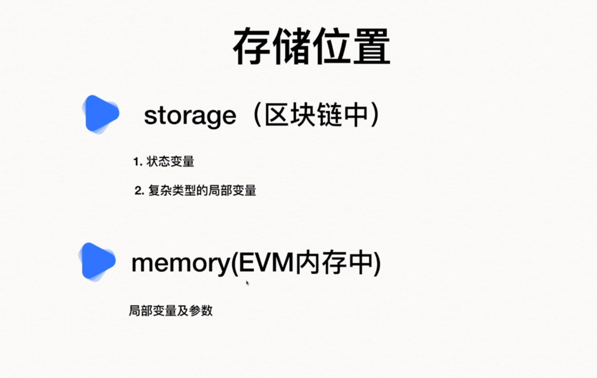
```js
// SPDX-License-Identifier: MIT 
pragma solidity ^0.8.20;

contract storage_demo {
    struct User {
        string name;
        uint8  age;
    }

    User adminuser;
    
    function setUser(string memory _name, uint8 _age) public {
        adminuser.name = _name;
        adminuser.age  = _age;
    }
    
    function getUser() public view returns (User memory) {
        return adminuser;
    }
    
    function setAge1(uint8 _age) public {
        User memory user = adminuser;  //改变不了adminuser
        user.age = _age;
    }
    
    function setAge2(uint8 _age) public {
        User storage user = adminuser; //可以改变adminuser
        user.age = _age;
    }
    
    function setAge3(User storage _user, uint8 _age) internal {
        _user.age = _age;
    }
    
    function callsetAge3(uint8 _age) public {
        setAge3(adminuser, _age);  //可以改变adminuser
    }
}
```

## 函数修饰器modifier
使用修饰器modifier可以轻松改变函数的行为。 例如，它们可以在执行函数之前自动检查某个条件。 
```js
contract owned {
  address owner;
  
  //修饰器所修饰的函数体会被插入到特殊符号 _; 的位置。
  modifier onlyOwner {
      require(
          msg.sender == owner,
          "Only owner can call this function."
      );
      _;
  }

  //只有合约的创建者才能销毁合约
  function destroy() public onlyOwner {
        selfdestruct(owner);
 }
}
```

## 函数选择器Selector
[参考](https://solidity-by-example.org/call/)
```js
abi.encodeWithSignature(....)的前四个字节就是函数选择器，也就是msg.sig,
也可这这样计算 bytes4(keccak256(bytes(_func)))
这种方法可以直接特定合约的方法
eg:
  addr.call(abi.encodeWithSignature("transfer(address,uint256)", SomeAddress, 123))
  bytes4(keccak256("set(uint256)"))

eg2:
  function foo(string memory _message, uint _x) public payable returns (uint) {
      emit Received(msg.sender, msg.value, _message);
      return _x + 1;
  }
  (bool success, bytes memory data) = _addr.call{value: msg.value, gas: 5000}(
    abi.encodeWithSignature("foo(string,uint256)", "call foo", 123)
  );
```


## 导入其他源文件
import * as symbolName from "filename";
import "filename" as symbolName;
然后所有函数都以`symbolName.symbol`格式提供。 

import 相当于接口，导入其它合约的函数，不过函数的执行环境不变，仍在原有合约中执行。例如：B中导入A，A.send()仍会在A的环境中执行。
import 演化成库和接口（interface）, 标准化程度更高。

eg:
```js
contract A {
    function add (uint x, uint y) public pure returns (uint) {
        return x.plus(y);
    }
}

import "./A.sol"
contract B {
    function add2 (A a, uint x, uint y) public pure returns (uint) {
        return a.add(x,y)
    }
}
```

## 库
library, 标准的函数，可以反复使用。调用时类似delegatecall
```js
// SPDX-License-Identifier: MIT  
pragma solidity ^0.8.20;
library mathlib {
  function plus(uint a, uint b) public pure returns (uint) {
    uint c = a + b;
    assert(c>=a && c>=b);
    return c;
  }
}

// SPDX-License-Identifier: MIT 
pragma solidity ^0.8.20;
import "./mathlib.sol";
contract testLib {
    using mathlib for uint;
    function add (uint x, uint y) public pure returns (uint) {
        return x.plus(y);
        // return mathlib.plus(x,y);
    }
}

//使用有两种方法：
一是直接使用：mathlib.plus(x,y)
二是拓展类型：
  using mathlib for uint;
  //using mathlib for uint[]
  x.plus(y);
```


## 错误异常
Assert, Require, Revert

assert(bool condition)
⽤于判断内部错误，条件不满⾜时抛出异常.函数只能用于测试内部错误，并检查非变量。
用于pure函数，会对用户惩罚，扣光gas

require(bool condition)
require(bool condition, string message) //提供错误信息。
函数用于确认条件有效性，例如输入变量，或合约状态变量是否满足条件，或验证外部合约调用返回的值。⽤于判断输⼊或外部组件错误，条件不满⾜时抛出异常。
会退还剩余gas

revert()  //终⽌执⾏并还原改变的状态
revert(string reason) //提供⼀个错误信息。
可以用来标记错误并回退当前的调用。 revert 调用中还可以包含有关错误信息的参数，这个信息会被返回给调用者。
```js
require(msg.value % 2 == 0, "Even value required.");
assert(this.balance == balanceBeforeTransfer - msg.value / 2);

if (amount > msg.value / 2 ether){
  revert("Not enough Ether provided.");
}
```

## 自定义错误
```js
error Myerror(address caller, uint i);

function test(uint _i) public view {
  if(_i > 10) {
    revert Myerror(msg.sender, _i);
  }
}
```

## delete
delete操作符可以用于任何变量，将其设置成默认值。
删除字符串时，会将其值重置为空。
删除枚举类型时，会将其值重置为序号为0的值。
如果对动态数组使用delete，则删除所有元素，其长度变为0。
如果对静态数组使用delete，则重置所有索引。
如果对map类型使用delete，什么都不会发生。
如果对map类型中的一个键使用delete，则会删除与该键相关的值。
```js
eg:
uint256 public number = 20;
address[] public addrs;

delete number; 
//number = 0;
delete addrs[1];
//addrs[1] = address(0); delete将对应数组中的元素重置为0地址。

contract DeleteDemo{
    bool public b  = true;
    uint public i = 1; 
    address public addr = msg.sender;
    bytes public varByte = "123";
    string  public str = "abc";
    enum Color{RED,GREEN,YELLOW}
    Color public color = Color.GREEN;
    
    function deleteAttr() public {
        delete b; // false
        delete i; // 0
        delete addr; // 0x0
        delete varByte; // 0x
        delete str; // ""
        delete color;//Color.RED
    }
}
```


## 销毁合约
合约代码从区块链上移除的唯一方式是合约在合约地址上的执行自毁操作 selfdestruct 。合约账户上剩余的以太币会发送给指定的目标，然后其存储和代码从状态中被移除。移除一个合约听上去不错，但其实有潜在的危险，如果有人发送以太币到移除的合约，这些以太币将永远丢失。

尽管一个合约的代码中没有显式地调用 selfdestruct ，它仍然有可能通过 delegatecall 或 callcode 执行自毁操作。
```
function destroy() public onlyOwner {
   selfdestruct(owner);
}
```

## 事件Events
事件是合约外部通知,在logs中查看。一般用于dapp监听使用。
事件在合约中可被继承。当他们被调用时，会使参数被存储到交易的日志中 —— 一种区块链中的特殊数据结构。
成本较低
```js
event Set(uint value);  
emit Set(x);  //触发事件

// SPDX-License-Identifier: MIT
pragma solidity ^0.8.20;

contract EventTest {
    event LogEvent(string indexed a, uint8 b);
    event TestEvent(string a);

    function eventFunction() public{
        emit LogEvent("hello", 101);
    }
    
    function test() public{
        emit TestEvent("world");
    }

    function getSig() public pure returns(bytes32, bytes32){
        bytes32 r1 = keccak256("TestEvent(string)");  //事件topic的值
        bytes32 r2 = keccak256("LogEvent(string,uint8)");
        return(r1, r2);
    }
}

其中 keccak256("TestEvent(string)")，即事件的签名，也是事件topic的值。
//logs-LogEvent
{
  "from": "0xa514f9ce4ceed99e4731b437123073f2d0c1745c",
  "topic": "0x449e54c0703954de7e4a92b7f921b71b2574e355474bdcfe8461f34d63e1e542",
  "event": "LogEvent",
  "args": {
    "0": {
      "hash": "0x1c8aff950685c2ed4bc3174f3472287b56d9517b9c948127319a09a7a36deac8",
      "type": "Indexed"
    },
    "1": 101,
    "a": {
      "hash": "0x1c8aff950685c2ed4bc3174f3472287b56d9517b9c948127319a09a7a36deac8",
      "type": "Indexed"
    },
    "b": 101,
    "length": 2
  }
  }

//logs-TestEvent
{
  "from": "0xa514f9ce4ceed99e4731b437123073f2d0c1745c",
  "topic": "0xe75028ff36bb6473da3731a30e1aeeae9988e2415dba2c4e91e0357955065fba",
  "event": "TestEvent",
  "args": {
    "0": "world",
    "a": "world",
    "length": 1
  }
  }
```

## 合约元素
1. 版本申明
2. 引用
3. 合约主体
4. 注释
```js
// SPDX-License-Identifier: MIT  //开源协议
pragma solidity ^0.8.20;//申明版本,最低0.8.20
/*
* 这是注释段落
*
*/
import "./first_interface.sol"; //引用文件

contract SimpleStorage {
    //合约主体
    uint storedData;

    function set(uint x) public {
        storedData = x;
    }
    
    function get() public view returns (uint) {
        return storedData;
    }
}
```

## 第一个合约
[合约详情](./contract/FirstContract.sol)

## 简单代币合约
```js
// SPDX-License-Identifier: MIT 
pragma solidity ^0.8.20;
contract SimpleToken{
    mapping(address => uint256) public balanceOf;
    uint id;
    constructor() {
        balanceOf[msg.sender] = 1000000;
    }

    function transfer(address _to, uint256 _value) public{
        require(balanceOf[msg.sender] >= _value);
        require(balanceOf[_to] + _value >= balanceOf[_to]);
        balanceOf[msg.sender] -= _value;
        balanceOf[_to] += _value;
    }
}
```

## ERC20
标准的内容：名称，发行量，统一函数名，事件
[参考 ｜](https://eips.ethereum.org/EIPS/eip-20)
[参考2 ｜](https://learnblockchain.cn/docs/eips/eip-20.html#api-规范)
[erc20｜](./contract/erc20.sol)
[OpenZeppelin](https://docs.openzeppelin.com/contracts/3.x/erc20)
```js
cnpm install @openzeppelin/contracts --save
// npm install @openzeppelin/contracts
// SPDX-License-Identifier: MIT 
pragma solidity ^0.8.20;
import "@openzeppelin/contracts/token/ERC20/ERC20.sol";
contract TutorialToken is ERC20 {
    constructor(uint256 initialSupply) ERC20("Gold", "GLD") {
        _mint(msg.sender, initialSupply);
    }
}
```

## 以太坊+IPFS数据存储可行方案
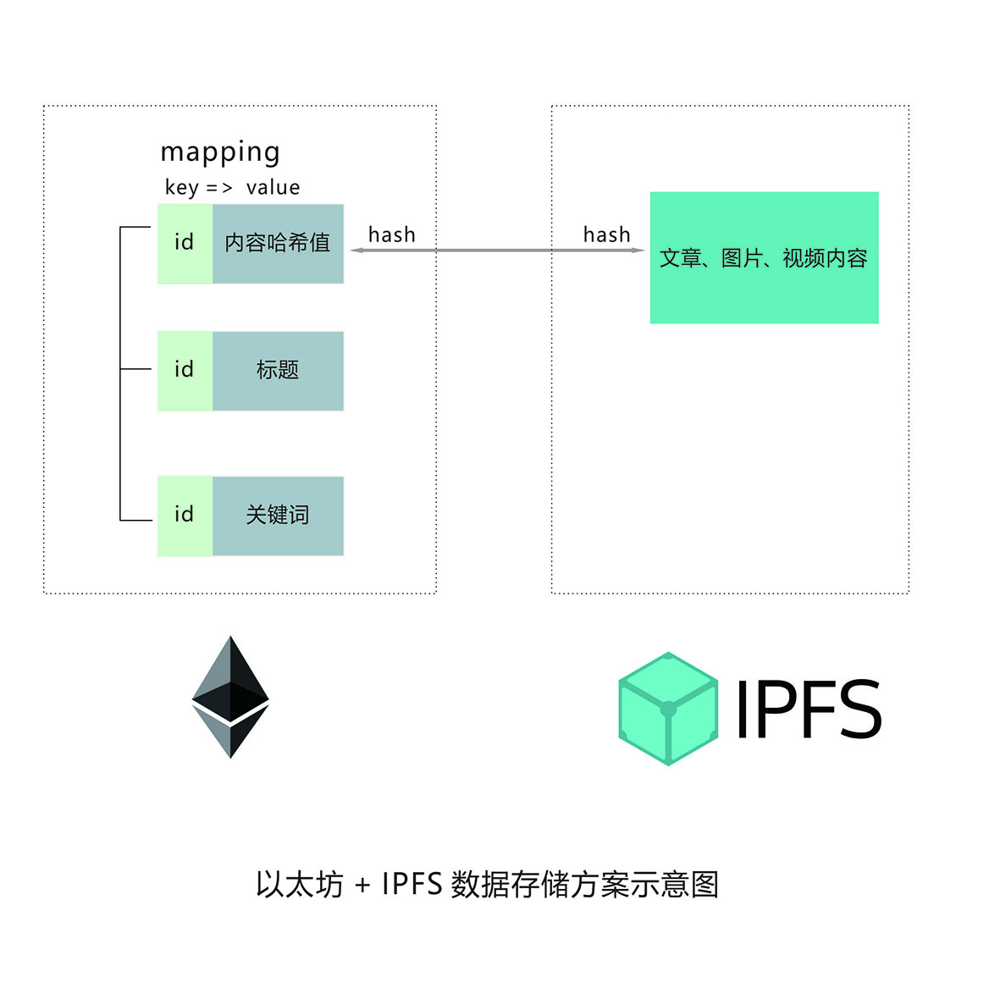


## 事件日志event
```js
curl https://ropsten.infura.io/v3/c9730c0636874b699e22887189adabc8 \
    -X POST \
    -H "Content-Type: application/json" \
    -d '{"jsonrpc":"2.0","method":"eth_getLogs","params":[{"blockHash": "
0x3e67aab36f8b32fcfe7518053d2e0c743af9a73f36bd14e39b33632e2bf8b367", "topics":["0x241ea03ca20251805084d27d4440371c34a0b85ff108f6bb5611248f73818b80"]}],"id":1}'

//实际上事件支持过滤器，可以从所有的区块中过滤出符合要求的事件，如：
var instructorEvent = info.Instructor({}, {fromBlock: 0, toBlock: 'latest'});

//或者是，要过滤出年龄 28 岁的记录，可以这样：
var instructorEvent = info.Instructor({ 'age': 28});

//比如，我们要获取到代币合约中，所有的转账记录， 就可以使用：
var transferEvent = token.Transfer({}, {fromBlock: 0, toBlock: 'latest'})
var transferEvent.watch(function(error, result){
// handle result.args.from  result.args.to 
```

## call和delegatecall
调用另一个合约中的函数，主要是两个方法：call 和 delegatecall。但推荐用接口调用！
call 会切换到被调合约中去执行方法，会切换上下文。msg.sender是主调合约地址。
delegatecall 则是将被调合约中的方法调到本合约中执行，也就是不会切换上下文。msg.sender是发起者本人。

传入的参数（address _addr）是合约地址。
```js
// SPDX-License-Identifier: MIT
pragma solidity ^0.8.20;

contract SetNum {
    uint256 public n = 20;
    address public sender;

    function setN(uint256 _n) public {
        n = _n;
        sender = msg.sender;
    }
}

contract CallSet {
    uint256 public n = 15;
    address public sender;

    function CallTest(address _addr, uint256 _n) public {
        _addr.call(abi.encodeWithSignature("setN(uint256)", _n));  //改变SetNum中的n值
        sender = msg.sender;  //是调用者本人，同时会改变SetNum的sender地址
    }

    function delegatecallTest(address _addr, uint256 _n) public {
        _addr.delegatecall(abi.encodeWithSignature("setN(uint256)", _n)); //改变自身的n值
        //(bool success, bytes memory data) = _contract.delegatecall(
        //     abi.encodeWithSignature("setVars(uint256)", _num)
        // );
        sender = msg.sender;  //是调用者本人，不会改变SetNum的sender地址
    }
}
```

## 底层调用calldata
[calldata调用](https://learnblockchain.cn/article/950)
[EVM的函数选择原理](https://learnblockchain.cn/article/3647)

Low level interactions 一般是调用receive() 或 fallback()
Low level interactions are used to send funds or calldata or funds & calldata to a contract through the receive() or fallback() function. Typically, you should only need to implement the fallback function if you are following an upgrade or proxy pattern.

The low level interactions section is below the functions in each deployed contract.
```js
//calldata计算的三种方法
a. bytes32 calldata = abi.encodeWithSignature("transfer(address,uint256)", SomeAddress, 123)
  addr.call(calldata)
  addr.call{value: msg.value, gas: 5000}(calldata) 

b. abi.encodeWithSelector(IERC20.transfer.selector, to, amount);
c. abi.encodeCall(IERC20.transfer, (to, amount));
```

## 抽象合约
抽象合约可以实现类似多态的功能。一个抽象合约被多个合约继承，对其方法可以有不同的实现，具体参看合约详情。
注意：两个合约间只是方法的实现，不会相互改变状态变量等。
[合约详情](./contract/abstract.sol)

## 接口
接口有点类似抽象合约的功能，可用于两个合约间的调用。是非侵入式接口，也就是不用显式的调用接口。
接口的调用类似call的调用。
注意：B中引用A的接口，A的函数仍会在A的环境中执行。

接口合约有两种不同的写法，如下详情：
[合约详情1](./contract/interface.sol)

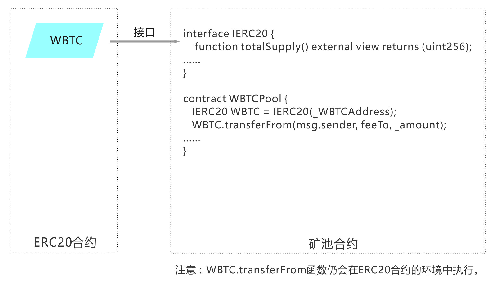 

一个合约想调用另一个合约的方法时，尽量用接口（第二种方法）来调用，不要用call, delegatecall。
注意：两个合约间通过接口会相互改变状态变量。
```js
// SPDX-License-Identifier: MIT
pragma solidity ^0.8.20;

interface FuncAdd {
    function add(uint x, uint y) external returns(uint);
}

contract TestAdd {
    //用合约地址来实例化接口
    FuncAdd t = FuncAdd(0x3dA5048CE9384a35fF4F3AAF0B4804114e584039);
    
    function test(uint x, uint y) public returns(uint){
        return t.add(x, y);
    }
}
```

## interface id
interface id是接口中所有函数选择器的异或值。
```js
function getSelector() public pure returns (bytes32, bytes4, bytes4) {
    //addUser(string memory _name, uint8 _age)
    bytes32 hash;
    //hash = keccak256(abi.encode("addUser(string,uint8)"));
    hash = keccak256("addUser(string,uint8)");
    return (hash, bytes4(hash), IUser.addUser.selector);
}

function getInterfaceID() public pure returns (bytes4) {
    return IUser.addUser.selector ^ IUser.getUser.selector;
}
```

## ABI
Application Binary Interface 应⽤程序⼆进制接⼝
调⽤⼀个合约函数 = 向合约地址发送⼀个交易(交易的内容就是 ABI 编码数据)

⽤ABI编码传递数据给合约，因此与合约交互离不开ABI

```js
abi.encode(...) returns (bytes) : 计算参数的ABI编码
abi.encodePacked(...) returns (bytes) : 计算参数的紧密打包编码，不会补零
abi.encodeWithSelector(bytes4 selector, ...) returns (bytes)：计算函数选择器和参数的ABI编码
abi.encodeWithSignature(string signature, ...) returns (bytes): 等价于 abi.encodeWithSelector(bytes4(keccak256(signature), ...)

eg:
function set(uint x) public {
   storedData = x;
}
function abiEncode() public constant returns (bytes) {
    return abi.encode(1, 2);  // 计算set(uint x) 的ABI编码
    // return abi.encodePacked(1, 2);
    // return abi.encodeWithSignature("set(uint256)" ,1); //计算函数ABI编码
}
```

## 数学和哈希函数
哈希函数（散列函数）：任意⻓度的输⼊，通过散列算法，变换成固定⻓度的输出
```js
addmod(uint x, uint y, uint k) returns (uint):
计算 (x + y) % k，加法会在任意精度下执行，并且加法的结果即使超过 2**256 也不会被截取。从 0.5.0 版本的编译器开始会加入对 k != 0 的校验（assert）。

mulmod(uint x, uint y, uint k) returns (uint):
计算 (x * y) % k，乘法会在任意精度下执行，并且乘法的结果即使超过 2**256 也不会被截取。从 0.5.0 版本的编译器开始会加入对 k != 0 的校验（assert）。

MD4 、 MD5、ripemd-160
SHA（Secure Hask Algorithm）密码散列函数家族

SHA家族:
SHA-1
SHA-2 : SHA-224、SHA-256、SHA-384，和SHA-512
SHA-3 : Keccak 算法

keccak256(…) returns (bytes32)
sha3(...) returns (bytes32)

sha256(...) returns (bytes32)
ripemd160(...) returns (bytes20) 

ecrecover(bytes32 hash, uint8 v, bytes32 r, bytes32 s) returns (address)
通过椭圆曲线签名来恢复与公钥关联的地址
四个参数
hash: 被签名数据的哈希结果值，r，s，v分别来⾃签名结果串
r = signature[0:64]
s = signature[64:128]
v = signature[128:130] + 27 


% 取模， 整除后的余数
return 561 % 10;  //1
return 56189 % 100; //89
return 56 % 2; //0
```

## 签名参数
```js
//v，s，r这三个参数是链下私钥签名签出来的, 这三个参数可以合成一个传给合约然后在合约里面做分割
function test(address owner, address sender, uint256 amount, bytes calldata sign) public {
    bytes32 digest = keccak256(abi.encodePacked(keccak256(abi.encode(sender, amount))));
    require(ecrecovery(digest, sign) == owner, "Sign Validation Failed");
}

function ecrecovery(bytes32 hash, bytes memory sig) private pure returns (address) {
    bytes32 r;
    bytes32 s;
    uint8 v;

    if (sig.length != 65) {
    return address(0);
    }

    assembly {
    r := mload(add(sig, 32))
    s := mload(add(sig, 64))
    v := and(mload(add(sig, 65)), 255)
    }

    // https://github.com/ethereum/go-ethereum/issues/2053
    if (v < 27) {
    v += 27;
    }

    if (v != 27 && v != 28) {
    return address(0);
    }

    /* prefix might be needed for geth only
    * https://github.com/ethereum/go-ethereum/issues/3731
    */
    // bytes memory prefix = "\x19Ethereum Signed Message:\n32";
    // hash = sha3(prefix, hash);

    return ecrecover(hash, v, r, s);
}

//
ecrecover(bytes32 hash, uint8 v, bytes32 r, bytes32 s) returns (address)
利用椭圆曲线签名恢复与公钥相关的地址，错误返回零值。
函数参数对应于 ECDSA签名的值:
r = 签名的前 32 字节
s = 签名的第2个32 字节
v = 签名的最后一个字节
ecrecover 返回一个 address, 而不是 address payable 。他们之前的转换参考 address payable ，如果需要转移资金到恢复的地址。
```

## 验证签名
[文档 ｜](https://solidity-by-example.org/signature/)
[视频](https://www.bilibili.com/video/BV1mF411W7Vt/?spm_id_from=pageDriver&vd_source=1cf00091b77c437b045c84f678152ab1)


## 投票合约
[合约详情](./contract/voting.sol)

## 转帐合约
[合约详情](./contract/transfer.sol)

## 批量转帐合约  
[合约详情](./contract/transfermany.sol)

## ICO合约
[合约详情](./contract/ico.sol)

## 买卖合约
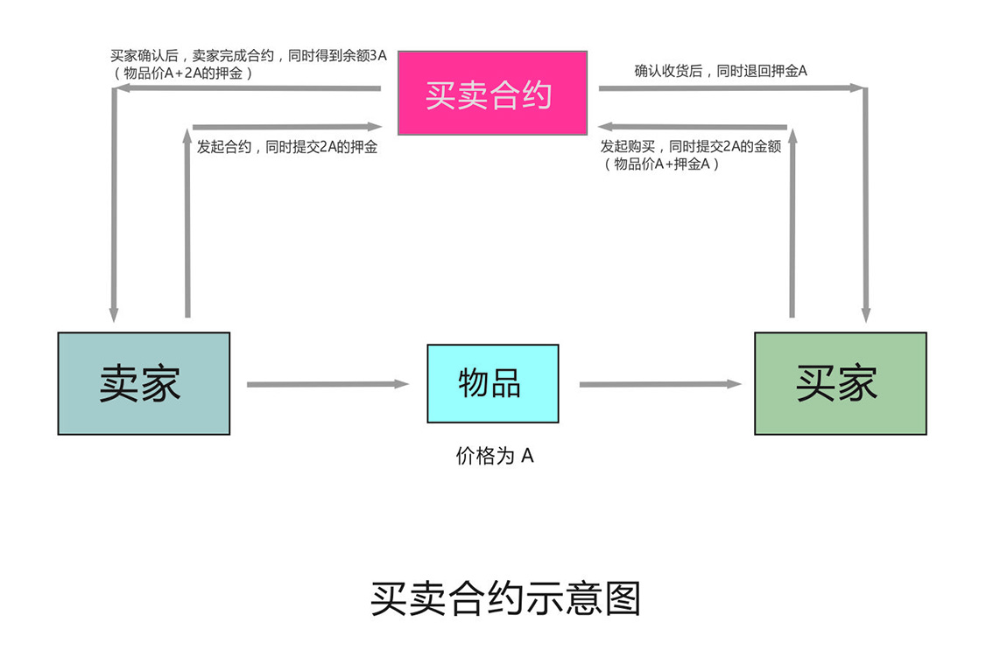

[合约详情](./contract/purchase.sol)

## SharesPool挖矿算法
[挖矿算法 |](https://miao.ilark.io/miaos/@lemooljiang/sharespool-32)
[合约详情 |](./contract/SharesPool.md)
[PeanutsPoolV2](./contract/PeanutsPoolV2.sol)


## 权限控制
以所有者、管理员赋权。本质是设置函数修改器，只有符合条件的人员才能调用函数。
[合约详情 |](./contract/roles.sol)
[AccessControl |](./contract/AccessControl.sol)
[Post](./contract/Post.sol)

## 判断字符串相等
在Solidity中是无法直接判断字符串相等的，可以通过哈希值是否相等来判断。
[参考](https://blog.csdn.net/weixin_43520099/article/details/106862928)
```js
//以字符串的哈希值来判断是否相等
function isEqual(string memory a, string memory b) public view returns (bool) {
    //return a == b;
    // hash(a) == hash(b)  ==>  a == b?
    bytes32 hashA = keccak256(abi.encode(a));
    bytes32 hashB = keccak256(abi.encode(b));
    return hashA == hashB;
}

//eg 但是计算哈希值很费时，可以在这之前先判断下bytes是否相等
function compareStr (string _str1, string _str2) public returns(bool) {
  if(bytes(_str1).length == bytes(_str2).length){
    if(keccak256(abi.encodePacked(_str1)) == keccak256(abi.encodePacked(_str2))) {
        return true;
    }
  }
   return false;
}
```  

## virtual与override
[参考](https://learnblockchain.cn/article/1184)

默认情况下，函数不再是虚函数(virtual) 。 这意味着调用非虚拟函数将始终执行该函数，而不管它的继承层次结构的其他合约。这减少了在solidity 0.5 中存在的歧义，在solidity 0.5版本中的所有函数都是隐式虚函数，从而可以在继承结构中进一步重写。 这在大型继承中尤其危险，在这种情况下，这种歧义可能导致意外的行为和错误。

如果父合约定义具有相同名称和参数类型的函数，子合约必须重写（override）同名函数。 在多重继承的示例中（如下），有同一个函数是从多个父合约（合约A和B）继承。在这种情况下，必须要重写，并且必须 override 修饰符中列出父合约。 要注意重要的一点，override(A,B) 中的顺序无关紧要， 它不会改变super的行为， super仍然由继承图的C3线性化决定，即继承关系由 contract C is A, B { ... }声明的顺序决定。
```js
contract A {
    uint public x;
    function setValue(uint _x) public virtual {
        x = _x;
    }
}

contract B {
    uint public y;
    function setValue(uint _y) public virtual {
        y = _y;
    }
}

contract C is A, B {
    function setValue(uint _x) public override(A,B) {
        A.setValue(_x);
    }
}

//继承中constructor的写法
contract A {
  uint public num;
  constructor (uint _num) {
    num = _num;
  }
}
//第一种方法 直接写入
contract B is A(23){

}
// 第二种方法 在构造方法中定义
contract B is A{
  constructor (uint _num) A(_num){
    
  }
}

//请注意，只有标记为virtual的函数才可以重写它们。 此外，任何重写的函数都必须标记为override 。 如果重写后依旧是可重写的，则仍然需要标记为virtual（译者注：也就是有 override 及 vritual 两个关键字标记符）。
```

## super关键字
当使用super时，调用的是继承的函数，不是它自己，比如下边给出的例子中，函数名字是相同的，要知道调用的不是它自己，是继承父合约中的同名函数。
```js
contract C {
     uint public u;
     function f() public virtual{
       u = 1;
     }
}

contract B is C {
     function f() public override virtual{
       u = 2;
     }
}

contract A is B {
     function f() public override{  // will set u to 3
       u = 3;
     }
     function f1() public{ // will set u to 2
       //当使用super时，调用的是继承的该函数，不是它自己，比如下边给出的例子中，函数名字是相同的，要知道调用的不是它自己，是继承父合约中的同名函数。
       super.f();
     }
     function f2() public { // will set u to 2
       B.f();
     }
     function f3() public { // will set u to 1
       C.f();
     }
}
```

## tx.origin
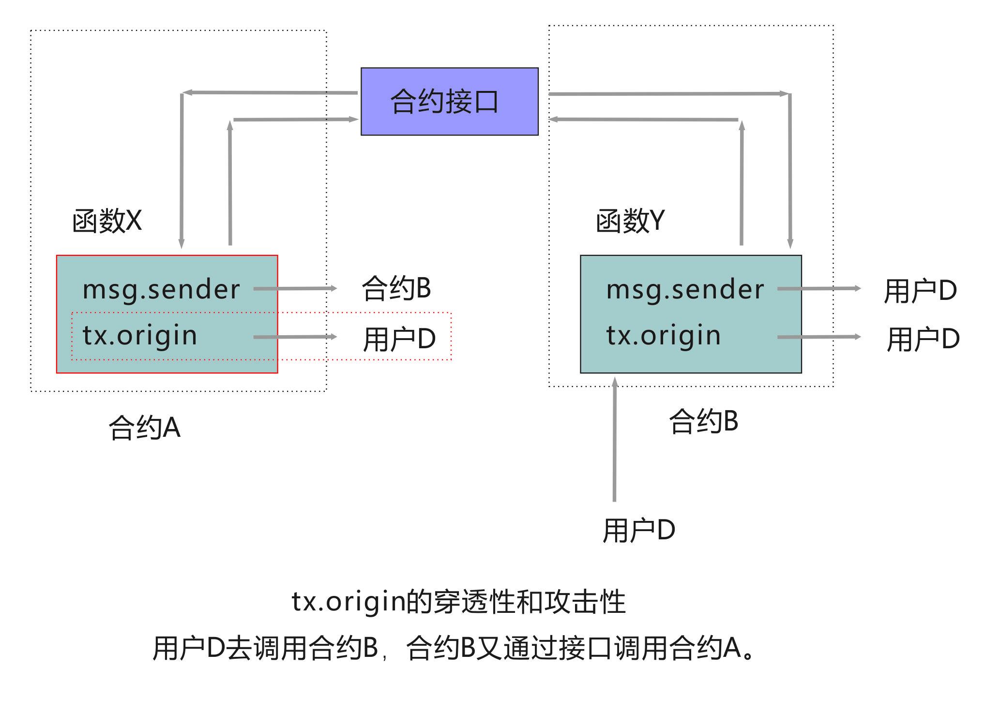

如上图所示，用户D通过合约B调用合约接口来调用合约A中的函数，这时tx.origin的穿透性就体现出来了。msg.sender只能得到直接调用它的地址（即合约B），得不到用户D的身份，只有tx.origin才能得到！所以，从这里可能看到，tx.origin具有的穿透的访问性。


## factory
从智能合约中创建另一个智能合约，就像一个工厂批量制造出产品一样。工厂模式的想法是拥有一个合约(工厂)，该合约将承担创建其他合约的任务。

工厂合约创建子合约有两种方法：new方法和create2方法。

[计算合约地址](https://learnblockchain.cn/2019/06/10/address-compute)
```js
//使用new关键字来创建子合约
// SPDX-License-Identifier: MIT
pragma solidity ^0.8.20;

contract Child{
  uint data;
  constructor(uint _data){
    data = _data;
  }
}

contract Factory {
  Child[] public children;
  function createChild(uint data) public {
    Child child = new Child(data);
    children.push(child);
  }
}


//使用create2方法创建子合约, uniswap用的此方法
// SPDX-License-Identifier: MIT
pragma solidity ^0.8.20;

contract Child{
  uint data;
  constructor(uint _data){
    data = _data;
  }
}

contract Factory {
  Child[] public children;
  function createChild(uint data) public {
    //给bytecode变量赋值"Child"合约的创建字节码
    bytes memory bytecode = type(Child).creationCode;
    //constructor
    bytes memory bytecode2 = abi.encodePacked(bytecode, abi.encode(data));

    //将msg.sender打包后创建哈希
    bytes32 salt = keccak256(abi.encodePacked(msg.sender));
    //内联汇编
    assembly {
        //通过create2方法布署合约,并且加盐,返回地址
      Child child := create2(0, add(bytecode2, 32), mload(bytecode2), salt)
    }
    children.push(child);
  }
}
```

## 存证合约
[单个存证 ｜](./contract/evidence/evidence.sol)
[存证工厂合约](./contract/evidence/factory.sol)

## SafeMath
solidity在0.8版本以前需要引入SafeMath库以避免计算时溢出，但在0.8版本以后自身已经集成了，则无需再引入。
```js
//SafeMath是从左到右开始计算的： + add  - sub  * mul  / div
uint a = 2;
uint b = 5;
uint c = 23;
(a+b)*c -> a.add(b).mul(c)

//0.8版本以后
uint x = 0;
x--;  //出错，会回滚

unchecked { ... }不检查溢出,
  uint x = 0;
  unchecked { x--; }  //返回最大值 type(uint).max

uint a = 2;
uint b = 5;
uint c = 23;
return a + b * c;   ->117
return (a + b) * c; ->161
return a * b + c;   ->33
return  b / a + c;  ->25
return c / (a + b); ->3 
```

## storage类型的坑点
```js
//正确
function pendingLark(uint256 _pid, address _user) public view returns (uint256) {
    PoolInfo storage pool = poolInfo[_pid];
    UserInfo storage user = userInfo[_pid][_user];  //此处有坑点
}

//错误
function pendingTest(uint256 _pid) public view returns (uint256) {
    PoolInfo storage pool = poolInfo[_pid];
    UserInfo storage user = userInfo[_pid][msg.sender]; //此处有坑点
}

//正确
function harvest(uint256 _pid) public returns (uint256){
    PoolInfo storage pool = poolInfo[_pid];
    UserInfo storage user = userInfo[_pid][msg.sender];
}

注意：storage类型在`view`函数中`msg.sender`不能正确解析，必须直接输入变量名!
```


## 一次性获取数组或结构体的所有数据
[参考](http://blog.hubwiz.com/2020/12/26/multicall-intro/)
```js
struct Delegator {
    uint256 amount;     
    uint256 rewardDebt;    
    bool    hasDeposited;  
    string  hiveAccount;      
}
mapping(address => Delegator) public delegators;
address[] public delegatorList;

//一次获取所有的代理人
function getDelegators() external view returns(address[] memory delegatorLists){
  delegatorLists = delegatorList;
}

//一次获取所有代理人的结构体数据
function getDelegatorsInfo() external view returns (Delegator[] memory returnData){
    returnData = new Delegator[](delegatorList.length);
    
    for(uint256 i = 0; i < delegatorList.length; i ++){
        returnData[i] = delegators[delegatorList[i]];
    }
    return returnData;
}
```

## 重入攻击
[参考](https://www.sohu.com/a/250422552_609552)

发生场景： 以太坊转帐。
原因：发送的对象不知是外部帐户（用户地址）还是合约帐户。如果是合约帐户，则有被重入攻击的风险。
```js
重入攻击发生在以太坊转帐的时候，msg.sender.call.value(_amount)(); 这条代码有重入风险。以太坊有两种帐户类型：一是外部帐户（用户地址），另一个是合约帐户 。如果是外部帐户，代码可以正常执行。但如果是合约的话，这条代码就有问题了。msg.sender.call.value(_amount)(); 会触发这个合约的fallback函数！如果fallback函数有恶意代码，那乐子就大啰！比如这样：
fallback() payable external {
    if(address(ibank).balance > 0){
        ibank.withdraw();  //这就相当于重复不停地取以太坊了！
    }
}

发生的原因在于以太坊转帐的函数上：sendValue(1 ether)和call{value: 1 ether}("")都有重入的风险，它们没有gas的限制，很可能会触发外部合约的攻击代码。安全的方法是使用transfer转帐。

eg:
//bank.sol
function withdraw() public payable {
    // msg.sender.call.value(_amount)();  //重入攻击 已修复
    // msg.sender.sendValue(1 ether); //重入攻击
    msg.sender.call{value: 1 ether}(""); //会被重入攻击
    // payable(msg.sender).transfer(1 ether); //不会重入攻击
}
//attack.sol
function iWithdraw() public payable {
    ibank.withdraw();
}
fallback() payable external {
    if(address(ibank).balance > 0){
        ibank.withdraw();
    }
}
//有时用receive也是可以的
receive() payable external {
   if(address(ibank).balance > 0){
        ibank.withdraw();
    }
}
```

## 防御重入攻击
[参考](https://zhuanlan.zhihu.com/p/368612227)
1. 在可能的情况下，将ether发送给外部地址时使用transfer()函数，transfer()转账时只发送2300gas。payable(msg.sender).transfer(1 ether);
2. 确保状态变量改变发生在ether被发送(或者任何外部调用)之前，即Solidity官方推荐的检查-生效-交互模式(checks-effects-interactions);
```js
function withdraw(uint _amount) public {
    if(balances[msg.sender] >= _amount) {//检查
       balances[msg.sender] -= _amount;//生效
       msg.sender.transfer(_amount);//交互
    }
 }
```

3. 使用互斥锁：添加一个在代码执行过程中锁定合约的状态变量，防止重入调用。
```js
bool reEntrancyMutex = false;
function withdraw(uint _amount) public {
    require(!reEntrancyMutex);
    reEntrancyMutex = true;
    if(balances[msg.sender] >= _amount) {
      if(msg.sender.call.value(_amount)()) {
        _amount;
      }
      balances[msg.sender] -= _amount;
      reEntrancyMutex = false;
    }
 }
```

## 汇编assembly
[教程 |](https://learnblockchain.cn/article/675)
[案例](https://jamesbachini.com/assembly-in-solidity/)
```js
contract StoringData {
  function setData(uint256 newValue) public {
    assembly {
      sstore(0, newValue)
    }
  }

  function getData() public view returns(uint256) {
    assembly {
      let v := sload(0)
      mstore(0x80, v)
      return(0x80, 32)
    }
  }
}

//send eth
success := call(gas(), _to, _amount, 0, 0, 0, 0)
```

## 代理合约升级
[案例 ｜](./contract/proxy.sol)
[参考代码 ｜](https://github.com/what-the-func/zos-upgradable-contract)
[视频 ｜](https://www.youtube.com/watch?v=kIHKo3DWuUo)
[深度剖析智能合约升级](https://segmentfault.com/a/1190000015732950)

## multicall
[案例](./contract/multicall.sol)
为了一次性读取一个或多个合约的函数，快速得到结果。
主要是通到call 或 staticcall来读取合约数据。
calldata的计算：
  abi.encodeWithSignature("test1()");
  或是abi.encodeWithSelector(this.test1.selector);
eg:
  targets.staticcall(calldata)
  targets: ["0xd9145CCE52D386f254917e481eB44e9943F39138","0xd9145CCE52D386f254917e481eB44e9943F39138"]
  calldata: ["0x6b59084d","0x66e41cb7"]

## 节约gas  
1. 最小化权限控制，尽量用external, private, internal, 尽量不用public
2. 变量类型优先使用calldata而不是memory
3. 加载状态变量到内存变量
4. 多个条件判断使用短路方式
5. 在循环中使用++i，而不是i+=1,i++
6. 数组长度缓存到内存
7. 缓存多次使用的数组元素到内存
[案例](https://solidity-by-example.org/gas-golf/)

## merkle tree proof
[文档 ｜](https://learnblockchain.cn/article/4521)
[文档2](https://learnblockchain.cn/article/4834)
```js
cnpm install keccak256 --save
cnpm install merkletreejs --save

eg:
const keccak256 = require('keccak256')
console.log(keccak256('hello').toString('hex')) // "1c8aff950685c2ed4bc3174f3472287b56d9517b9c948127319a09a7a36deac8

///NFT whitelist proof
//index.js
const hexProof = merkletree.getHexProof(keccak256("0x5B38Da6a701c568545dCfcB03FcB875f56beddC4"));    
console.log(133, hexProof);   // Proof array as hex strings  
//数组要加双引号！！！！ hexProof，也就是合约中_merkleProof的值  
//["0xbe09a843e96d820323ffaac74f0f119734db1f158ac0d0d5b627ac7f3bcc82c2","0x3780ab1ad79638640229c918da7258b76eeb41ed7c94297cd81e39fb7dac617d","0x431b716a8beab170ce17253d7f6ae35d9e21105745fbafa9c0f13b6a18219be1"] 
console.log(124, merkletree.verify(hexProof, keccak256("0x5B38Da6a701c568545dCfcB03FcB875f56beddC4"), rootHash));  //true

//whiteList.sol
bytes32 leaf = keccak256(abi.encodePacked(msg.sender));
require(MerkleProof.verify(_merkleProof, merkleRoot, leaf), "Invaild proof.");

//两个叶子节点计算哈希值 
let res = keccak256("0x5B38Da6a701c568545dCfcB03FcB875f56beddC4")  //左节点
let res2 = keccak256("0x18b2a687610328590bc8f2e5fedde3b582a49cda") //右节点
console.log(888, res2,89, res.toString('hex'))
console.log(999, res2,89, res2.toString('hex'))
let cc = keccak256(Buffer.concat([res,res2]))
console.log(222, cc,89, cc.toString('hex'))

////16进制转buffer
var hex = 'AA5504B10000B5'
var typedArray = new Uint8Array(hex.match(/[\da-f]{2}/gi).map(function (h) {
  return parseInt(h, 16)
}))
var buffer = typedArray.buffer
```

## graph
[案例 ｜](https://github.com/itsjerryokolo/CryptoPunks)

## 监听合约事件
```js
//contract
event	EventName(uint	param);	
emit	EventName(10);

//js
var	e	=	contractInstance.EvevtName()
e.watch(function(err,	result)	{	
  if(!err){
     console.log(result.args.name)
  } else {
    console.log(err)
  }	
})
```