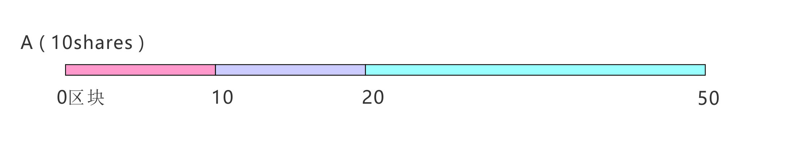

## SharesPool挖矿算法

[挖矿算法 |](https://www.steemjiang.com/trend/@lemooljiang/g71qeu)
[参考1 |](https://shimo.im/docs/XqQwqVDWcXYyQQwX/read)
[参考2](https://shimo.im/docs/Tt9rvgDKXx9vtdDC)

[PeanutsPoolV2](./PeanutsPoolV2.sol)

在区块链中以Shares为量计算挖矿，是现在流行的pool设计，例如SUSHI的流动性挖矿。设定每区块奖励、算法等参数就可以开启挖矿啰！这里的算法设计可供大家参考。

rewardsPerShare 
全局参数，每股份的奖励数，不断累加。当用户存款、取出或是提现奖励时会更新。
lastRewardBlock
全局参数，上一次奖励的块标记，表示当前的挖矿进度。每当Share有变动时都会更新。


user.shares
用户私有参数，表示用户的存款量。
user.debtRewards
用户私有参数，该用户已经提取的奖励数。在新的奖励点计算该用户奖励时需要剔除的奖励数。

然后再引入三个计算公式：
rewardsPerShare = rewardsPerShare + Rewards[from, to]/totalShares[from, to]
其中rewardsPerShare初始值为0，Rewards[from, to]代表一定区块高度所新产生的奖励，totalShares[from, to]表示当前总存款量。
每次有Share变动，或是提现时都应该更新此值，它是不断累加的。

user.rewards = user.shares(更新前) * rewardsPerShare - user.debtRewards
其中user.rewards表示用户在当前区块下所能获得的奖励，user.shares 是用户更新前的值，刚进入时为0.

user.shares =  newShare //更新share
user.debtRewards = user.shares * rewardsPerShare
其中user.shares表示用户的存款量，是更新后的值

## 只有一位用户时的情况


A在0区块存入10shares，每个区块一个奖励，此时：
```
rewardsPerShare = 0
A.shares = 10
A.debtRewards = 0
totalShares = 10
lastRewardBlock = 0
```
1. 当在10区块时A的奖励(只是计算并没有提现，所有参数并没有更新)：
```
rewardsPerShare = rewardsPerShare + Rewards[0, 10]/totalShares[0, 10]
                = 0 + 10/10 = 1
A.rewards = user.shares * rewardsPerShare - user.debtRewards
          = 10 * 1 - 0  = 10
```         
2. 当在20区块时提现：
提现时先更新rewardsPerShare，计算奖励。然后再更新debtRewards和lastRewardBlock。
```
rewardsPerShare = rewardsPerShare + Rewards[0, 20]/totalShares[0, 20]
                = 0 + 20/10 = 2
A.rewards = A.shares * rewardsPerShare - A.debtRewards
          = 10 * 2 - 0  = 20
//提现后更新          
A.debtRewards = A.shares * rewardsPerShare  
          = 10 * 2 = 20  
lastRewardBlock = 20               
```
## 多位用户

假设有这些操作：A在0区块存入10shares，B在10区块存入20shares，A在20区块增加至20shares，此时：

0区块时（增加A的参数）：
```
rewardsPerShare = 0
A.shares = 10
A.debtRewards = 0
totalShares = 10
lastRewardBlock = 0
```

10区块时（A的私有参数不受影响，增加B的参数）：
```
rewardsPerShare = rewardsPerShare + Rewards[0, 10]/totalShares[0, 10]
                = 0 + 10/10 = 1
B.shares = 20
B.debtRewards = B.shares * rewardsPerShare
              = 20 * 1 = 20
totalShares = 30
lastRewardBlock = 10
```

20区块时（A增加至20shares，B的私有参数不受影响）：

此时A会将之前的奖励提现，同时更新shares和debtRewards。
```
rewardsPerShare = rewardsPerShare + Rewards[10, 20]/totalShares[10, 20]
                = 1 + 10/30 = 4/3
A.RewardsOut = A.shares(更新之前) * rewardsPerShare - A.debtRewards(更新之前)
                   = 10 * 4/3 - 0 = 40/3 = 13.333
//提现后更新                   
A.shares = 20                   
A.debtRewards = A.shares(更新之后) * rewardsPerShare
              = 20 * 4/3 = 80/3
totalShares = 40
lastRewardBlock = 20
```

50区块时计算各自的奖励：
```
rewardsPerShare = rewardsPerShare + Rewards[20, 50]/totalShares[20, 50]
                = 4/3 + 30/40 = 25/12
A.rewards = A.shares * rewardsPerShare - A.debtRewards
          = 20 * 25/12 - 80/3 = 15
B.rewards = B.shares * rewardsPerShare - B.debtRewards
          = 20 * 25/12 - 20 = 65/3 = 21.666
注： totalRewards =  A.RewardsOut +  A.rewards + B.rewards = 50     
```

因为Solidity中不能有小数点，这里的rewardsPerShare最好都 *1e12来提高精度。 这种算法很实用，有想法的朋友不妨动手试试。   
